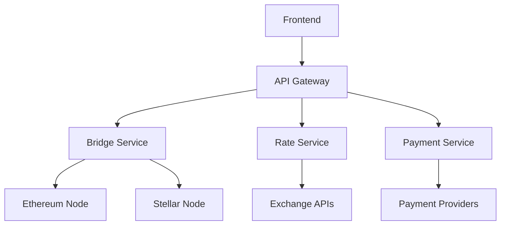

# System Architecture

## Overview

The CrossFlow USDC Bridge is built with a microservices architecture, focusing on scalability, reliability, and security.

## Core Components

### 1. Bridge Service

The bridge service handles CrossFlow transfers using the Connext protocol:

```typescript
interface BridgeTransaction {
  sourceChain: string;
  targetChain: string;
  amount: string;
  senderAddress: string;
  recipientAddress: string;
}
```

### 2. Rate Service

Manages real-time exchange rates:

- Integration with Flutterwave for African currency rates
- CoinGecko API for USDC/USD rates
- Rate caching and updates

### 3. Blockchain Services

#### Ethereum Service

- USDC contract interactions
- Transaction monitoring
- Gas price estimation

#### Stellar Service

- USDC trustline management
- Transaction submission
- Account creation and funding

### 4. Payment Service

Handles fiat on/off ramps:

- Bank transfers
- Mobile money
- USSD payments
- Card payments

## Database Schema

### Users Table

```sql
CREATE TABLE users (
  id UUID PRIMARY KEY,
  email TEXT UNIQUE,
  ethereum_address TEXT,
  stellar_address TEXT,
  created_at TIMESTAMPTZ
);
```

### Transactions Table

```sql
CREATE TABLE transactions (
  id UUID PRIMARY KEY,
  user_id UUID REFERENCES users(id),
  type TEXT,
  amount DECIMAL,
  status TEXT,
  source_chain TEXT,
  target_chain TEXT,
  created_at TIMESTAMPTZ
);
```

## Security Architecture

1. **Authentication**

   - JWT-based auth
   - Wallet signature verification
   - Rate limiting

2. **Database Security**

   - Row-level security
   - Prepared statements
   - Connection pooling

3. **API Security**
   - Input validation
   - CORS configuration
   - Request sanitization

## Monitoring & Logging

- Transaction status monitoring
- Error tracking
- Performance metrics
- Audit logging

## Deployment Architecture


